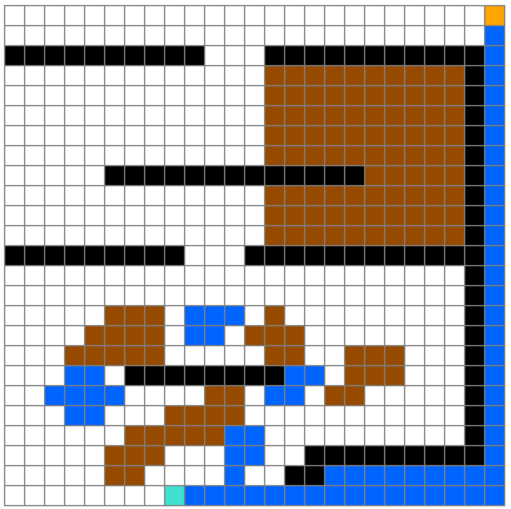
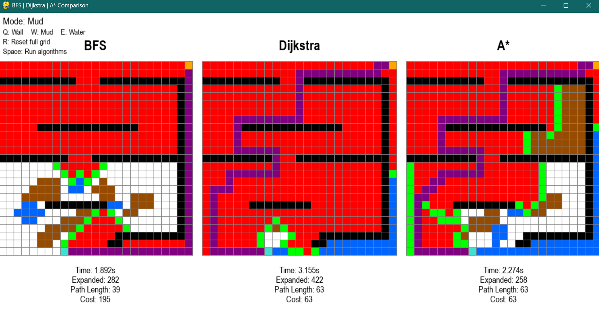
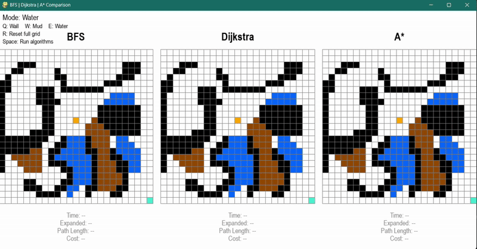

# 🗺️ Pathfinding Visualizer: A* vs Dijkstra vs BFS

An interactive Python-based visualization tool that compares three popular pathfinding algorithms side-by-side: **A\* (A-Star)**, **Dijkstra's Algorithm**, and **Breadth-First Search (BFS)**. Built with Pygame, this application provides a real-time visual comparison to help understand how each algorithm explores the grid and computes a path under its own strategy.


## ✨ Features

- **Side-by-Side Comparison**: Run all three algorithms simultaneously on identical grids
- **Interactive Grid**: Click and drag to create start/end points and obstacles
- **Real-Time Visualization**: Watch algorithms explore the grid in real-time
- **Comprehensive Performance Metrics**: Compare execution time, nodes expanded, path length, and total path cost
- **Weighted Terrain System**: Three terrain types with different movement costs (Normal: 1, Mud: 3, Water: 5)
- **Resizable Window**: Dynamic UI that maintains 2:1 aspect ratio with letterboxing for optimal viewing
- **Visual Feedback**: Color-coded cells show explored nodes, paths, obstacles, and terrain types
- **Intuitive Controls**: Quick-switch terrain modes with keyboard shortcuts

## 🎯 Algorithms Implemented

### A* (A-Star) Algorithm
- **Type**: Informed search algorithm
- **Heuristic**: Manhattan distance
- **Weight Handling**: Considers terrain weights in path cost calculation
- **Optimality**: Guaranteed to find the path with the least cost
- **Efficiency**: Generally fastest due to heuristic guidance toward the goal

### Dijkstra's Algorithm
- **Type**: Uninformed search algorithm
- **Strategy**: Explores nodes based on cumulative cost (including terrain weights)
- **Weight Handling**: Naturally considers terrain weights, avoiding expensive terrain
- **Optimality**: Guaranteed to find the path with the least cost
- **Efficiency**: Explores more nodes than A* but reliable

### Breadth-First Search (BFS)
- **Type**: Uninformed search algorithm
- **Strategy**: Explores level by level
- **Weight Handling**: Does not consider terrain weights (treats all terrain equally)
- **Optimality**: Finds the shortest path in steps, but not optimal in cost for weighted terrain
- **Efficiency**: Simple but explores many nodes and may choose higher-cost paths

## 🚀 Getting Started

### Prerequisites

- Python 3.7 or higher
- Pygame library

### Installation

1. **Clone the repository**
   ```bash
   git clone https://github.com/HaloV01d/Pathfinding-Visualizer-A-vs-Dijkstra.git
   cd Pathfinding-Visualizer-A-vs-Dijkstra
   ```

2. **Install dependencies**
   ```bash
   pip install pygame
   ```

3. **Run the application**
   ```bash
   python joint_UI.py
   ```

## 🎮 How to Use

### Controls

1. **Left Click**: 
   - First click: Set start point (Orange)
   - Second click: Set end point (Turquoise)
   - Additional clicks: Draw terrain based on current mode (Wall/Mud/Water)

2. **Right Click**: 
   - Remove obstacles or reset cells to normal terrain

3. **Keyboard Controls**:
   - `SPACE`: Start the visualization and run all three algorithms
   - `R`: Reset the entire grid (clears start, end, obstacles, and statistics)
   - `Q`: Switch to Wall mode (Black obstacles with infinite cost)
   - `W`: Switch to Mud mode (Brown terrain with weight 3)
   - `E`: Switch to Water mode (Blue terrain with weight 5)

### Workflow

1. Launch the application with `python joint_UI.py`
2. Click on the **center grid** to place your start point (orange)
3. Click again to place your end point (turquoise)
4. Select terrain mode using `Q` (walls), `W` (mud), or `E` (water)
5. Draw terrain by clicking and dragging on the center grid
6. Press `SPACE` to run all three algorithms simultaneously
7. Observe the differences in how each algorithm explores the grid across all three panels
8. Compare the performance metrics displayed below each algorithm (Time, Expanded nodes, Path Length, Cost)
9. Press `R` to reset and try different scenarios

## 📊 Understanding the Visualization

### Color Legend

| Color | Meaning |
|-------|---------|
| 🟠 Orange | Start point |
| 🔵 Turquoise | End point |
| ⚫ Black | Wall/Obstacle |
| 🟢 Green | Explored nodes |
| 🔴 Red | Discovered nodes |
| 🟣 Purple | Final path |
| ⬜ White | Normal terrain (weight: 1) |
| 🟫 Brown | Mud terrain (weight: 3) |
| 🟦 Blue | Water terrain (weight: 5) |

### Performance Metrics

The application displays comprehensive statistics for each algorithm below its panel:
- **Execution Time**: How long the algorithm took to find the path (in seconds)
- **Nodes Expanded**: Number of nodes explored/closed during the search (shown in red)
- **Path Length**: Number of steps in the final path found (shown in purple)
- **Cost**: Total accumulated cost of the path considering terrain weights (sum of weights along purple path)

## 📁 Project Structure

```
Pathfinding-Visualizer-A-vs-Dijkstra/
│
├── joint_UI.py        # Main application with side-by-side comparison
├── A_Star.py          # A* algorithm implementation
├── Dijkstra.py        # Dijkstra's algorithm implementation
├── BFS.py             # Breadth-First Search implementation
├── grid.py            # Grid and Box class definitions
└── README.md          # Project documentation
```

## 🧠 Algorithm Comparison

| Algorithm | Time Complexity | Space Complexity | Uses Heuristic | Best Use Case |
|-----------|-----------------------|------------------|----------------|---------------|
| **A\*** | O((E log V) | O(V) | ✅ Yes | Best for finding lowest cost path efficiently with a good heuristic |
| **Dijkstra** | O(E log V) | O(V) | ❌ No | Weighted graphs, guaranteed lowest cost path |
| **BFS** | O(V+E) | O(V) | ❌ No | Unweighted graphs, level-by-level exploration for shortest path |


*V = vertices, E = edges*

## 🎓 Educational Value

This visualizer is perfect for:
- Computer Science students learning pathfinding algorithms
- Understanding the trade-offs between different search strategies
- Visualizing how heuristics improve search efficiency
- Comparing algorithm performance in different scenarios

## 🛠️ Technical Details

- **Grid Size**: 25×25 cells (configurable in `grid.py`)
- **Window**: Resizable with maintained 2:1 aspect ratio (default: 1240×620 pixels)
- **Rendering**: Pygame-based real-time visualization with letterboxing for optimal grid display
- **Architecture**: Modular design with separate algorithm implementations
- **Terrain System**: Weighted graph with three terrain types (Normal, Mud, Water)
- **Pathfinding**: Uses priority queues (heapq) for A* and Dijkstra, deque for BFS
- **Visualization**: All three grids updated synchronously; only center grid is editable

## 💡 Key Insights from Visualization

### Why A* is Faster
A* uses the Manhattan distance heuristic to guide its search towards the goal, resulting in fewer nodes explored compared to uninformed algorithms. On weighted terrain, A* efficiently balances the cost-so-far with the estimated cost-to-goal.

### When to Use Each Algorithm
- **A***: When you need the fastest minimum cost path and can define a good heuristic (best for weighted graphs)
- **Dijkstra**: When you need a guaranteed minimum cost path without a heuristic (reliable for weighted graphs)
- **BFS**: When all edges have equal weight and you only care about the shortest path in steps (not suitable for weighted terrain optimization)

### Observable Differences on Weighted Terrain
- **A*** explores in a focused direction toward the goal thanks to the heuristic, expanding far fewer nodes while still finding the optimal low-cost path.
- **Dijkstra** expands outward uniformly based on cumulative cost, methodically avoiding expensive terrain like water and mud, guaranteeing the lowest-cost path.
- **BFS** expands outward level-by-level, completely ignoring terrain weights. It finds the path with the fewest steps but often results in a much higher total cost, traversing expensive terrain unnecessarily.

### Terrain Weight Impact
The weighted terrain system (Normal=1, Mud=3, Water=5) demonstrates how A* and Dijkstra intelligently route around expensive terrain, while BFS treats all terrain equally and may choose paths that cross high-cost areas if they have fewer steps.

## 📌 Example Scenarios
The following examples demonstrate how the visualizer behaves on weighted grids:

### Scenario A – Weighted Terrain:




### Scenario A – Results:




### Scenario B – Weighted Terrain (animated):



### Ideas for Enhancement
- Add more heuristics (Euclidean, Chebyshev, Octile)
- Implement more terrain types with configurable weights
- Add diagonal movement option (8-directional instead of 4-directional)
- Include more algorithms (Greedy Best-First, Jump Point Search, Bidirectional Search)
- Export visualization as GIF/video
- Add animation speed control
- Implement grid save/load functionality
- Add random maze generation
- Display visited nodes in real-time during algorithm execution
 
